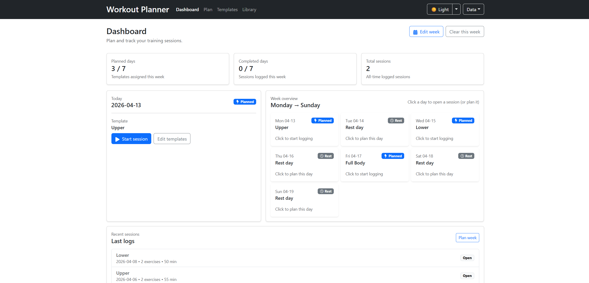
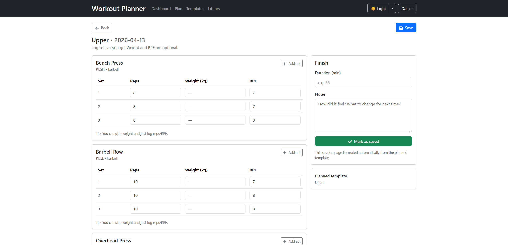
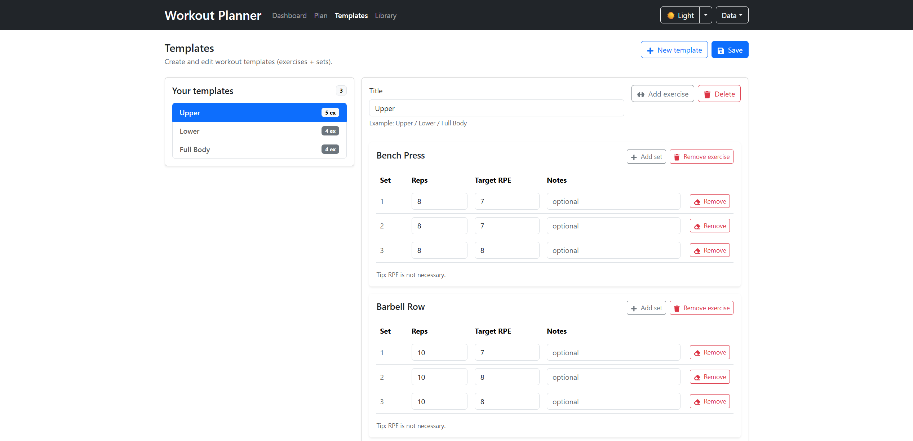

# Workout Planner

A workout planning application built with React and TypeScript.

Plan your training week, create reusable workout templates, and log your sessions in a lightweight app using localStorage.

---

## ✨ Features

* 📅 Weekly workout planning (assign templates to days)
* 🏋️ Reusable workout templates (e.g. Upper / Lower / Full Body)
* 📚 Exercise library with search and filtering
* 📝 Session logging (reps, weight, RPE)
* 🌙 Dark / Light mode (with system theme support)
* 💾 Local storage persistence (no backend required)
* 📤 Export and import data as JSON
* 🔄 Reset to seed data

---

## 🛠️ Tech Stack

* **React** (Vite)
* **TypeScript**
* **React Router**
* **Bootstrap**
* **React Toastify**

---

## 🚀 Getting Started

### Requirements

- Node.js
- npm

### 1. Clone the repository

```bash
git clone https://github.com/icehusky5/Workout_Planner.git
```

### 2. Install dependencies

```bash
npm install
```

### 3. Start the development server

```bash
npm run dev
```

### 4. Open in a browser

```
http://localhost:5173
```

---

## 🧩 How It Works

* **Templates** define exercises and set structures
* **Week Plan** assigns templates to specific dates
* **Sessions** are automatically created from templates when opened
* All data is stored in **localStorage**
* You can export and import your data using JSON backups

---

## 📸 Screenshots

### Dashboard


### Session


### Templates


---

## 🔮 Future Improvements

* Support for time-based sets (seconds vs reps)
* Editing exercises directly from templates
* Workout statistics and progress tracking

---

## 🧠 Notes

This project focuses on:

* Clean component structure
* Type-safe data modeling with TypeScript
* Practical and minimal UI for real-world usage
